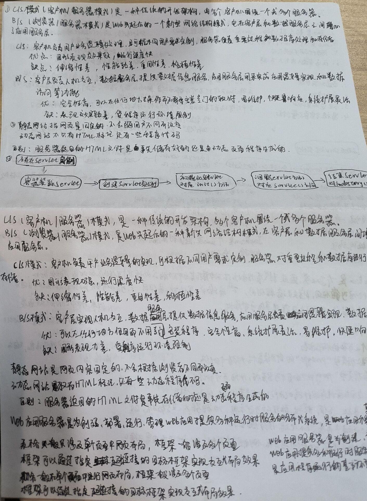
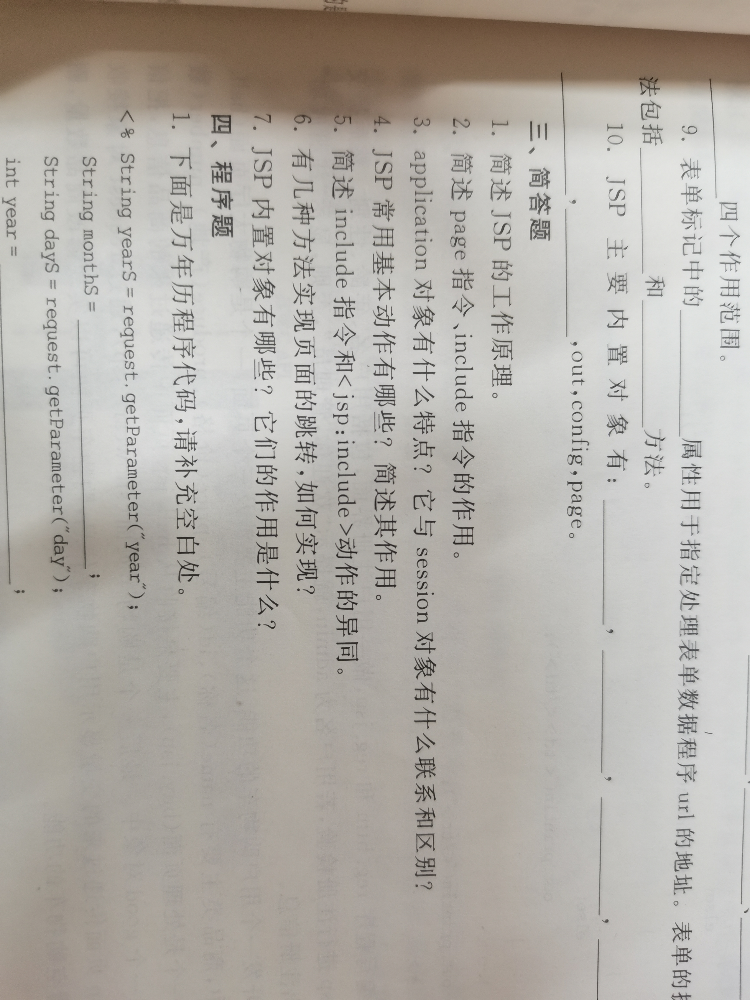
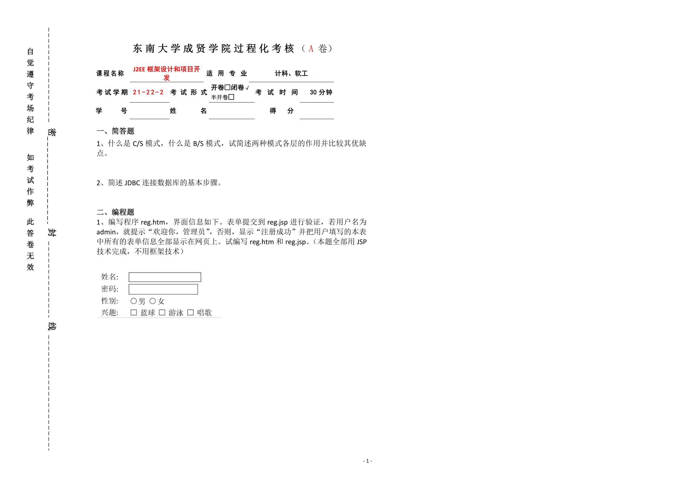
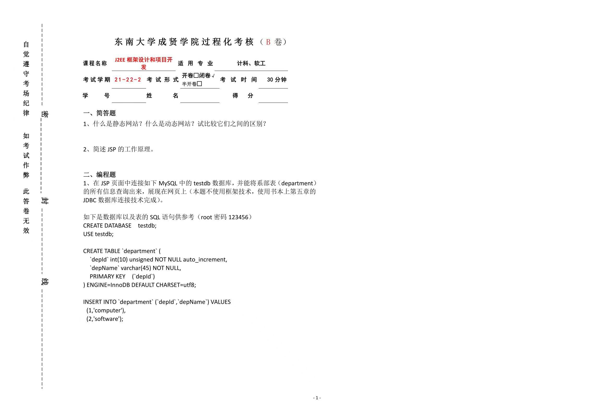

# j2ee 第一次测试复习资料










简答 1：什么是 b/s,什么是 c/s,作用和优缺点 c/s 即(client/server)client:客户端，负责接收用户输入，向服务器发送请求，并处理服务器返回的结果。server:服务器，负责接受客户端请求，处理请求并把结果返回给客户优点：拥有灵活性和性能优化缺点：维护成本高 b/s 即（browser/server)browser:浏览器，作为客户端，负责向服务器发送请求，并呈现服务器返回的结果。server:服务器，接受浏览器的请求，并将结果返回给浏览器。优点：易用性，集中管理缺点：性能问题，依赖网络简答 2：什么是静态网页和动态网页，及区别静态网页：只有 HTML 标记，没有程序代码动态网页：不仅含有 HTML 页面，还有程序代码区别：是否连接数据库简答 3：web 应用服务器的用途可以向浏览器等 web 客户端提供文档简答 4：简述 Java 和 JavaScript 区别 1：用途 Java 是面向对象的编程语言，JavaScript 是脚本语言 2：类型 Java 是静态类型语言（编译的时需声明变量类型）JavaScript 是动态类型语言（变量类型在运行时确认）简答 5：jsp 工作原理将 jsp 文件编译成 servlet 然后在服务器端执行 servlet 生成动态内容，将最终结果发送给客户端浏览器简答 6：简述 page 和 include 指令作用 page：用于设置 jsp 页面的各种属性 include:用于包含其他文件内容到当前 jsp 页面简答 7：application 对象特点和 session 对象有什么区别和联系特点 1：全局性：所有用户共享一个 application 对象特点 2：生命周期：在应用程序启动时创建，在其关闭时销毁特点 3：作用范围：application 对象中存储的数据可以在整个应用程序中共享 联系：都是 JavaServlet 中存储数据的对象，都可以用于不同页面间传递数据区别：1：前者是全局的，后者是针对每一个用户的 2：前者生命周期是整个应用程序的，后者是用户会话的生命周期 3：作用范围不同简答 8：JSP 常用基本动作 1<jsp:include> 用于 jsp 页面包含其他页面内容 2<jsp:forward>用于 jsp 页面内部页面跳转 3<jsp:useBean>在 jsp 页面使用 JavaBean 对象简答 9：include 和<jsp:include>异同点相同点：1 都可以用于 jsp 页面包含其他 jsp 页面的内容 2 它们包含的内容会在页面编译时直接插入到当前页面相应位置异：前者是一种静态指令，后者是一种动态动作前者在 jsp 页面编译的时候就会被处理，后者在 jsp 页面执行的时候被处理前者不支持传递参数，后者支持标签传递参数简答 10：实现页面跳转的几种方法 1 使用重定向 2 使用请求转发 3 使用 HTML 的超链接 4 使用 JavaScript 的 window.location 属性 5 使用框架的路由功能简答 11：JSP 内置对象有哪些及作用 1request:代表客户端的 http 请求 2response:代表服务器对客户端的 HTTP 响应 3session：代表客户端和服务器之间的会话 4application：代表 web 应用程序的全局作用域 5page:代表当前 jsp 页面本身简答 12：jsp 通过什么连接数据库，以及涉及哪些基本类使用 jdbc 方式连接涉及的基本类：DriverManager/Connection/Statement 和 PrepareStatement/Resultset 简答 13：什么是 jdbc,在访问数据库起到的作用是 java 提供的用于连接和操作数据库的 API 作用：连接数据库，执行 sql 语句，处理事务简答 14：jdbc 连接数据库的基本步骤 1 加载数据库驱动程序 2 建立数据库连接 3 创建并执行 SQL 语句 4 处理查询结果 5 关闭连接简答 15：jdbc 提供的两种实现数据查询的方法 1:statement 2:prepared Statement 简答 16：什么是 javaBean,使用其的优点是 java 平台上的一种特定的编程规范优点 1 可重用性 2 易于管理简答 17：标准 javabean 需要哪些条件 1 公共的无参构造方法 2 私有的属性 3 符合 JavaBean 命名规范 4 实现序列化接口表单参考代码

```html
<html>
  <head>
    <title>.....</title>
  </head>
  <body>
    <form action=" " method="post" name="myForm">
      <p>姓名：<input type="text" name="name" /></p>
      <p>密码: <input type="password" name="password" /></p>
      <p>
        性别：男<input
          type="radio"
          checked="checked"
          name="sex"
          value="male"
        />女<input type="radio" name="sex" value="female" />
      </p>
      <p>
        血型: O<input type="radio" checked="checked" name="BG" value="O" />
        A<input type="radio" name="BG" value="A" /> B<input
          type="radio"
          name="BG"
          value="B"
        />
        AB<input type="radio" name="BG" value="AB" />
      </p>
      <p>
        性格:热情大方<input type="checkbox" name="warmth" />温柔体贴<input
          type="checkbox"
          name="tender"
        />多情善感<input type="checkbox" name="sentimento" />
      </p>
      <p>
        城市:<select name="place">
          <option value="benjingshi">北京市</option>
          <option value="shandongshi">山东市</option>
          <option value="henanshi">河南市</option>
        </select>
      </p>
      <p>文件:<input type="file" name="file" id="file" /></p>
      <p>个人简介: <textarea name="textarea" cols="20" row="50"></textarea></p>
      <input type="submit" value="提交" /> <input type="reset" value="RESET" />
    </form>
  </body>
</html>
```

三种方法输出 hello world

```html
<html>
  <head>
    <title></title>
  </head>
  <body>
    <button onclick="show1()">1点击这里</button
    ><button onclick="show2()">2点击这里</button
    ><button onclick="show3()">3点击这里</button>
    <script type="text/javascript">
      function show1() {
        alert("hello world");
      }
      function show2() {
        document.write("hello world");
      }
      function show3() {
        var input = window.prompt("请输入内容");
        window.alert("内容为" + input);
      }
    </script>
  </body>
</html>
检验输入合法性
<html>
  <head>
    <title>javascript验证输入的合理性</title>
    <script type="text/javascript">
      function check() {
        var name = document.getElementById("name").value;
        var password = document.getElementById("password").value;
        if (name == null || name == "") {
          alert("请输入用户名");
          return false;
        }
        if (password == null || password == "") {
          alert("请输入密码");
          return false;
        } else return true;
      }
    </script>
  </head>
  <body>
    <form method="post" name="myForm" action="" onsubmit="return check();">
      用户名:<input type="text" id="name" name="texName" /><br />密码:<input
        type="password"
        id="password"
      /><br /><input type="submit" value="登录" /><input
        type="reset"
        value="重置"
      />
    </form>
  </body>
</html>
```
